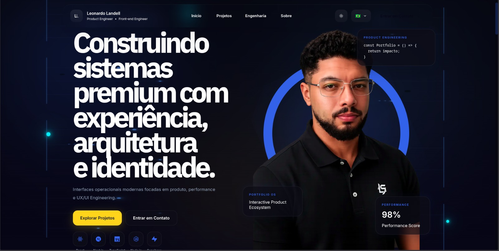
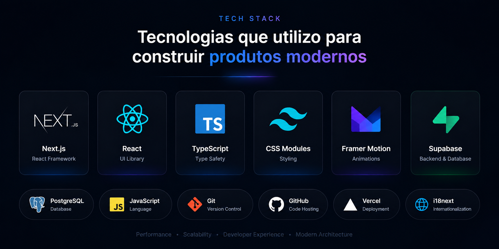

# Leonardo Landell

Frontend Engineer • Product Engineer • Interactive Systems

---

## About

Portfolio developed to showcase projects, engineering decisions and product systems focused on scalable frontend architecture, UX engineering and interactive digital experiences.

The objective is to demonstrate not only visual interfaces, but also product thinking, technical architecture and operational workflows behind each solution.

---

## Tech Stack

### Frontend

* React
* Next.js
* TypeScript
* JavaScript
* CSS Modules
* Framer Motion

### Product Engineering

* Design Systems
* UX Engineering
* Responsive Design
* Accessibility
* Internationalization (i18n)

### Data & Infrastructure

* Supabase
* PostgreSQL
* REST APIs
* Git
* GitHub
* Vercel

---

# Featured Projects

## ForecastOS

Operational analytics platform focused on forecasting, metrics and executive decision making.

### Highlights

* Analytics Engine
* Real-Time Dashboards
* Executive Insights
* Enterprise UX
* Interactive Data Visualization

### Stack

Next.js • TypeScript • Chart.js • Framer Motion • Supabase

---

## Mini CRM OS

Modern CRM inspired by enterprise SaaS products, focused on operational intelligence and customer workflows.

### Highlights

* CRM Dashboard
* Kanban Pipeline
* Sales Flow
* Product UX
* SaaS Architecture

### Stack

Next.js • TypeScript • DND Kit • Framer Motion • Supabase

---

## ProjectOS

Workspace focused on productivity, project management and operational systems.

### Highlights

* Project Management
* Task Workflows
* Operational Systems
* Productivity Environment
* Product Engineering

### Stack

React • Next.js • TypeScript • Zustand • Material UI

---

## Engineering Principles

* Scalability First
* Product-Oriented Architecture
* Performance Focused
* Maintainable Systems
* User-Centered Experiences
* Interactive Interfaces

---

## Contact

### LinkedIn

[www.linkedin.com/in/leonardo-landell](http://www.linkedin.com/in/leonardo-landell)

### GitHub

github.com/LeonardoLandell

### Email

[leonardolandell666@gmail.com](mailto:leonardolandell666@gmail.com)

---

Built with Next.js, TypeScript and Product Engineering principles.
